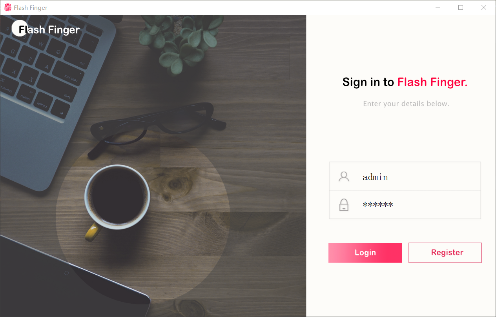
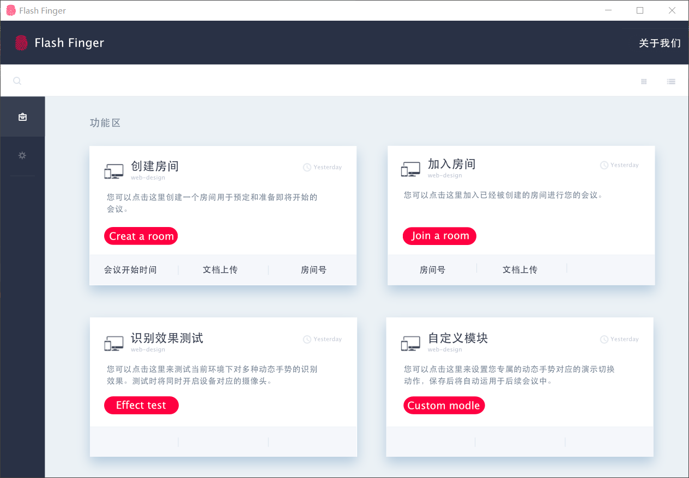
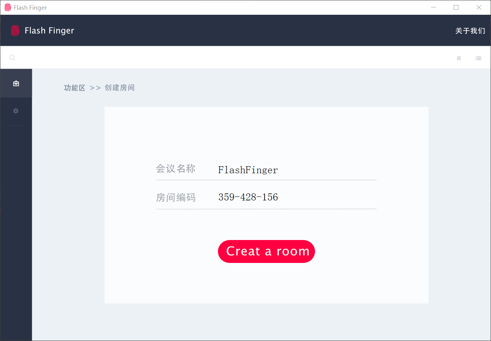
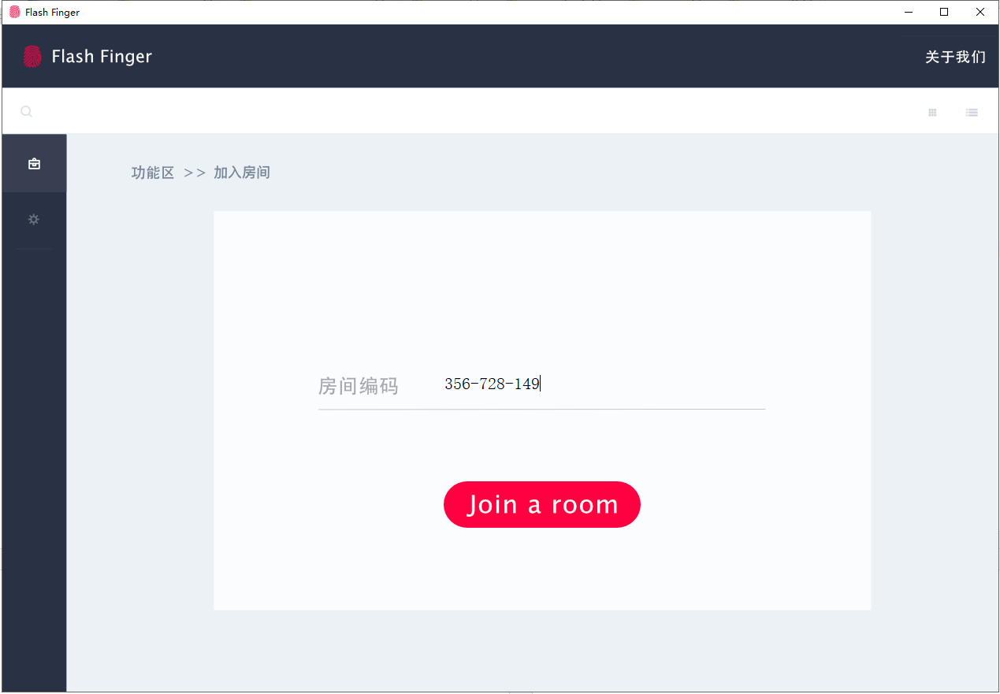
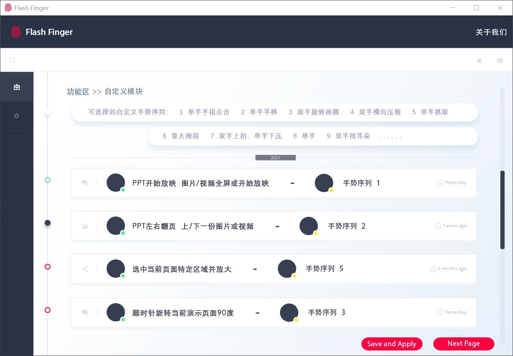
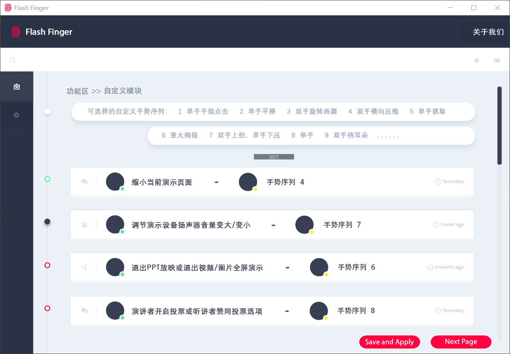
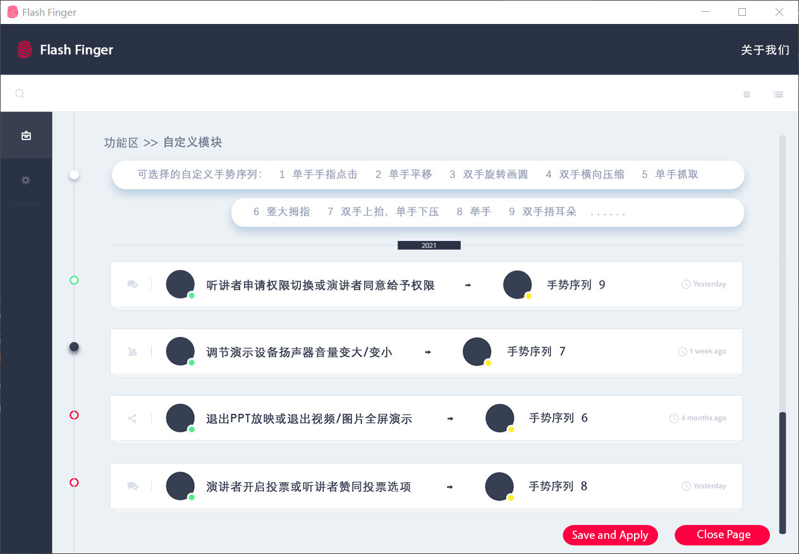
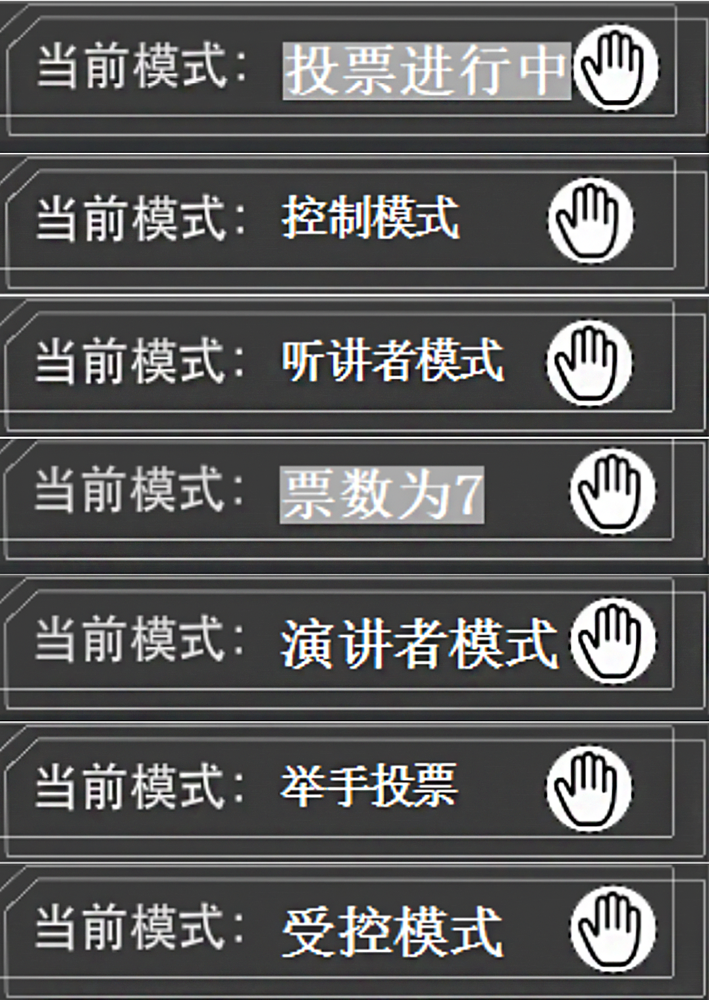

**基于手势识别的会商演示**

---

<p align="center">
    <a href="https:FlashFinger.top/">Website</a> 
</p>

<p align="center">
    <a href="https://FlashFinger.top">
        
    </a>
</p>

---


### 简介

`Flash Finger`手势识别会议演示系统的开发主要目标在于：通过计算机视觉技 术实现对基于视频流的手势动作如单手平移、双手协同旋转、单手点击等进行实 时检测和识别。通过对基于摄像头采集的连续视频输入中用户的手势动作进行检 测和识别，输出相应的控制信号，从而高效完成会商演示系统的交互。

##### 我们系统的系统亮点  

1. 收集大量既定手势训练集，结合 3dConvLSTM 模型实现对多种手势的训练， 并保证高手势识别准确率和手势识别速率。 

2. 拥有智能的交互机制，处于听众(参会)模式的用户可向处于演讲者(汇报)模式的用户申请控制设备的权限，演讲者(汇报) 模式用户同意请求之后，处于听众(参会)模式的用户可通过自定义手势控制其设备，从而更加高效地进行点评和协同探讨。 

3. 支持各类用户对系统内已存在的手势和功能进行对应自定义，为用户提供个性化的手势自定义服务。 

4. 自动将会议中用户所做出的手势动 作自动收纳到后台模型的训练集，能够自动对 3dConvLSTM 模型进行训练和更新。 

5. 支持多用户同时使用 Flash Finger 系统，在线查询相关数据。并能合适地处理冲突，当服务器端负载过大时，返回等待信号，维持系统良好运行。 

6. 完善的系统体系，为个人用户及企业用户提供在线创建会议、加入会议的一站式服务平台，节约人力成本。 

7. 服务器可以防御多种外来攻击，更好地维护用户隐私数据安全。

8. 完整的用户反馈机制，用户可对系统存在的问题向后台进行实时反馈，后台管理员将对用户反馈进行及时处理。 

9. 强大的系统数据仓库，系统管理员可选择分类或总计查看系统使用数据。 

10. 系统依据用户种类分成了专为企业用户而设计的专业版以及为个人用户设 计的普通版，企业版基于普通版而实现，更加专业化地满足了企业会商的需求， 但现阶段企业版仍在研发和试运行阶段。

---


### 效果展示

<video src="README.assets/realperform.mp4"></video>

### 使用说明

以下操作适用于window10平台。

#### 一：点击文件目录下的 FlashFingerinstaller.exe

​	先下载我们的FlashFinger文件夹，文件目录如下：

​	此时文件目录应为如下所示：

```
FlashFinger
├── image
    └── ...
├── resource 
    ├── backbone
        ├── strided_inflated_efficientnet.ckpt
        └── strided_inflated_mobilenet.ckpt
├── sense
    └── ...

├── tools
    └── ... 
├── .travis.yml
├── clientM.py
├── FlashFinger.exe
├── Mywxpython.py
├── requirements.txt
└── README.md
```

若您的电脑已经安装python3.6及以上版本，请访问https://cloud.189.cn/t/7V7RVjABz6ri下载site-packages文件夹，复制到\python\Lib\文件夹，覆盖原有文件；

若您的电脑未安装python3.6及以上版本，请访问https://cloud.189.cn/t/mQJb2ybaENbm下载python文件夹，将其中内容添加到python文件夹中；

以上两个文件我们会实时更新，最新的下载链接请访问我们的网站（flashfinger.top或http://47.98.40.28:8001/）

若仍然无法正常启动，请在终端执行

```
pip install -r requirement.txt
```

若仍然无法正常启动，请联系我们

这样您就成功配置了环境，可以顺利运行 FlashFingerinstaller.exe。祝您使用愉快！

#### 二：点击FlashFinger.exe运行程序

1. 登录界面 在此界面可进行登录、注册操作，并有主页页面的链接。



2. 主界面 



3. 创建房间界面 



4. 加入房间界面 



5. 自定义模块界面







​	自定义面板提供修改特定手势动作与对应键盘映射的功能，可以根据自己的 使用习惯设置左右手模式，并将手势和对应操作进行绑定。

6. 工具栏界面 创建或加入房间之后，Flash Finger 窗口将化为悬浮式工具栏，始终浮在窗 口最上方。当进行例如投票、权限转换等操作时，工具栏上的字样会发生改变， 提示用户当前所处的状态。 



#### 三：关于我们的演示demo

若您想不想通过UI使用我们的产品，您也可以通过打开tools下的new_run_class.py文件，即可运行我们的手势识别与控制系统小demo。此时您还可以通过打开demo文件夹的index.html打开我们的手势识别本地服务器展示界面。祝您使用愉快！

